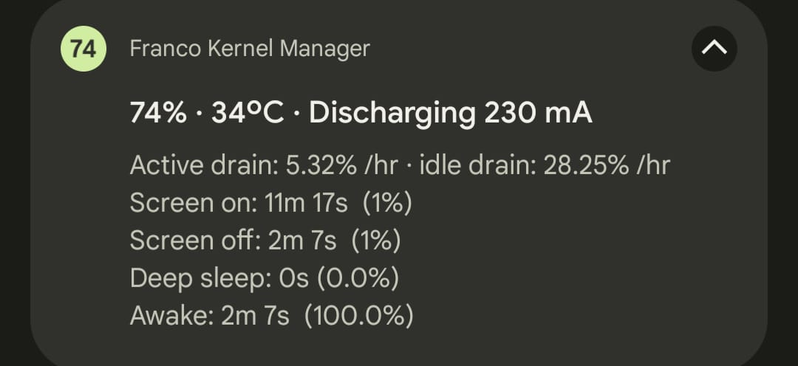
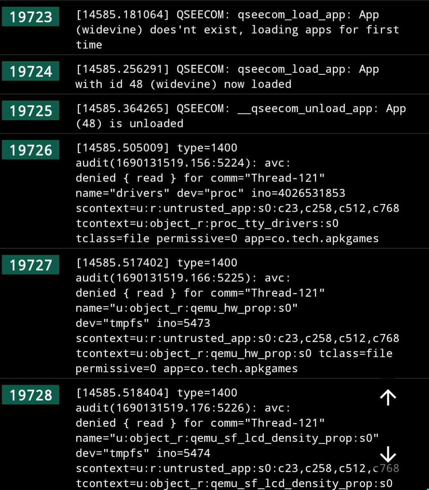
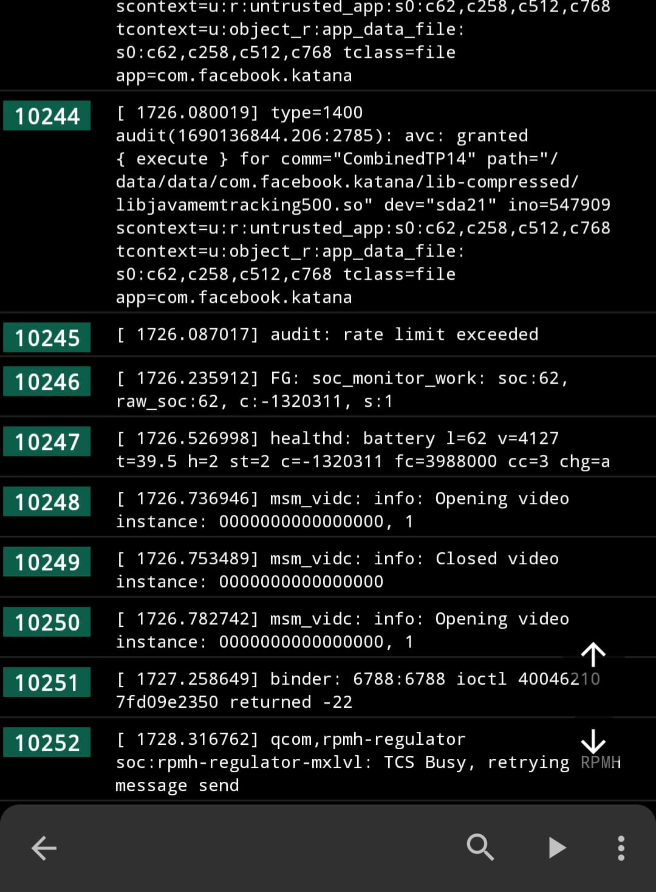
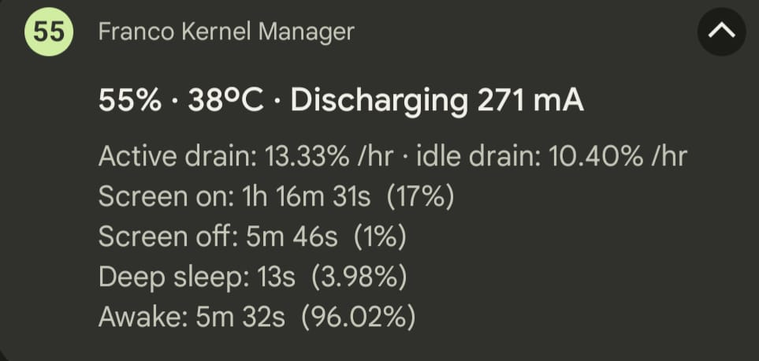
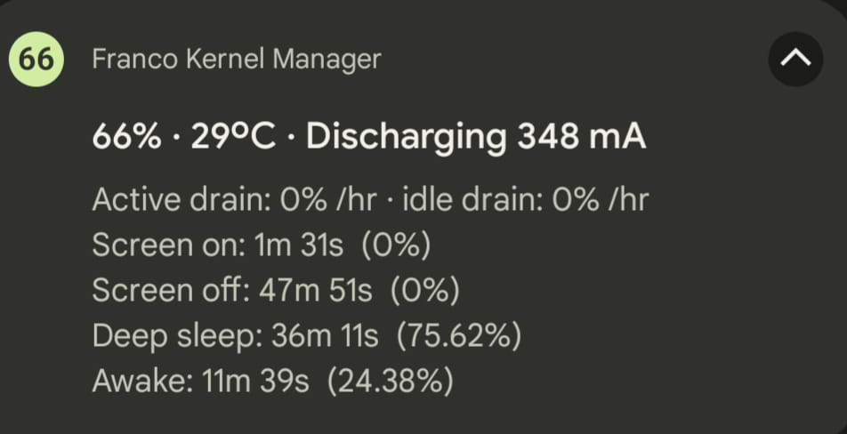

# **Deep sleep, High idle drain, high temperature fix**

## **UPDATE** ***5/3/24***
- The issue still exist in the last A13 build. This could theoretically be exactly like what Apple purposely did where they made the older iPhones to have battery drain issues on the latest version of iOS that it supports, to gaslight users into thinking they have hardware battery problem but in reality they forced users to upgrade and buy newer iPhones.
Apple admitted this and you can do a quick search to [verify this](https://letmegooglethat.com/?q=apple+admits+planned+iphone+battery+failure)

## **UPDATE** ***7/25/23***

- Install [ACC Magisk Module](https://github.com/VR-25/acc), as simple as that. You won't be needing to flash any Gapps.zip
Note: Use Androidacy Module Manager If you're having trouble install it in Magisk.

## TL;DR: To long don't wanna read (**Outdated** but still works

- Flash the **latest** [NikGapps](https://sourceforge.net/projects/nikgapps/files/Releases/)
- Make sure to **edit** the **nikgapps.config** to avoid overwriting your ROM's default launcher (Usefull if your Custom ROM uses it's own custom launcher eg. EvoX, crDroid)
- **crDroid users** you could use this instead [crDroid NikGapps](https://sourceforge.net/projects/nikgapps/files/Elite-Releases/Gwolf2u/NikGapps-T/)
- Clean **Dalvik Cache** & **Cache** before you **reboot**

## Table of contents

- [Deep sleep, High idle drain, high temperature fix](#deep-sleep-high-idle-drain-high-temperature-fix)
  - [UPDATE ***5/3/24***](#update-5324)
  - [UPDATE ***7/25/23***](#update-72523)
  - [TL;DR: To long don't wanna read](#tldr-to-long-dont-wanna-read)
  - [Table of contents](#table-of-contents)
  - [Overview: The Issue / Problem details](#overview-the-issue--problem-details)
  - [Solution: What I did to try and fix it](#solution-what-i-did-to-try-and-fix-it)
  - [Note](#note)

## Overview: The Issue / Problem details

- ***Battery drain was high only when*** the ***screen was off***.  
[*0% Deep Sleep*](./Screenshot_20230724-005714_Evolution-X.jpg) 
- A lot of people not only from [EvoX Telegram](https://t.me/EvolutionXBeryllium) & [crDroid Telegram](https://t.me/crDroidPoco) are experiencing this issue and have been for a few weeks. (Some even tried to go back to their previous Custom ROM before trying out **EvoX** or **crDroid**), but the problem won't go away.
  
## Solution: What I did to try and fix it

- ***I'm not an Android developer so take this with a grain of salt***

1. I cleaned the Type-C port.
2. I flashed the SilverCore kernel, but that didn't help.
3. I looked for answers:
   1. Clean the charging port or
   2. Change the *sub board* or *charging PCB board* (No follow-up update 😐)
   3. Clear Google Play Services data (Tried it, but the issue still exist)
   4. I found someone who said something about an event in the wakelock about the USB port reactivating every few seconds.

4. I checked the wakelock events (I have no idea what most of them are)  

5. I flashed NikGapps latest A13 July 16 build. *(It replaced the ROM's default Launcher because I forgot to edit the config file)*

   - Reset my battery usage
   - Turned off the screen for a few minutes, [the result:](./Screenshot_20230724-021352_Pixel.jpg)
  
   - I reset the battery stats again, plugged in the charger, turned off the screen & that fixes the annoying problem, [the result:](Screenshot_20230724-032349_Pixel.jpg)
  

## Note

- I noticed that more and more people are having this problem. It's becoming widespread day-by-day. If you think about it, the people who are experiencing it the most are the ***Google apps users***.
- It just happened to my phone last week, and it's almost always up-to-date, so it must be the recent updates, right? ***(probably)***
- Flashing the full July 16 NikGapps build fixes it. ***(Coincidence?)***
- It undid itself and the battery drain problem came back. (***New updated method*** at the top)